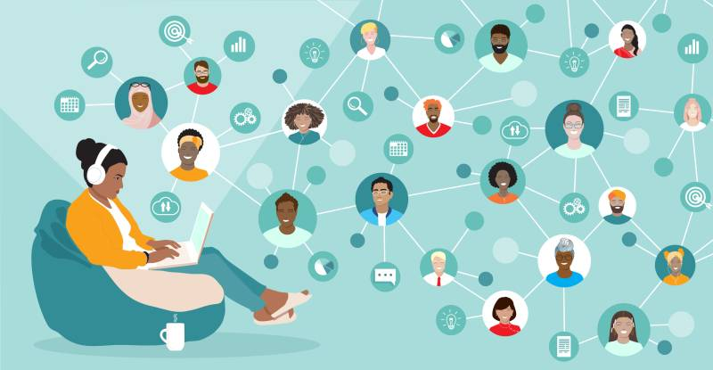

# Events i Comunitats

Relació events i comunitats informàtiques

Aquí teniu disponible una relació de conferències tècniques i de grups de meetup que us poden ser d'interès. S'intentarà que la informació sigui el més actualitzada possible. Contacteu amb mi per si cal fer alguna rectificació o voleu proposar alguna entrada a les seccions.

## Propers events destacats 

- [DevBCN: 16-17 de juny](https://www.devbcn.com/2026)
- [4th Video Game Week: 10-14 de juny](https://www.cotxeres-casinet.cat/programacions-culturals/cultura-digital/)
- [OLX Masterclass Product Design: 16 de juny](https://www.eventbrite.co.uk/e/entradas-olx-masterclass-product-design-1987311887352)

## [Conferències](conferencies.md)

Conferències i jornades agrupades per temàtica. S'inclouen tant les que es fan a Barcelona com algunes de les destacades que es fan a Madrid.

## [Grups meetup](meetup.md)

Selecció de grups temàtics a Meetup de la zona de Barcelona i rodalies que organitzen sessions i xerrades

Contacte: <carlos.martinez@mataro.epiaedu.cat>

Darrera actualització: 05/06/2026
